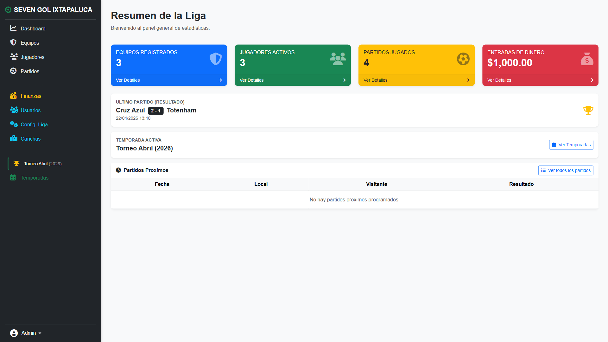
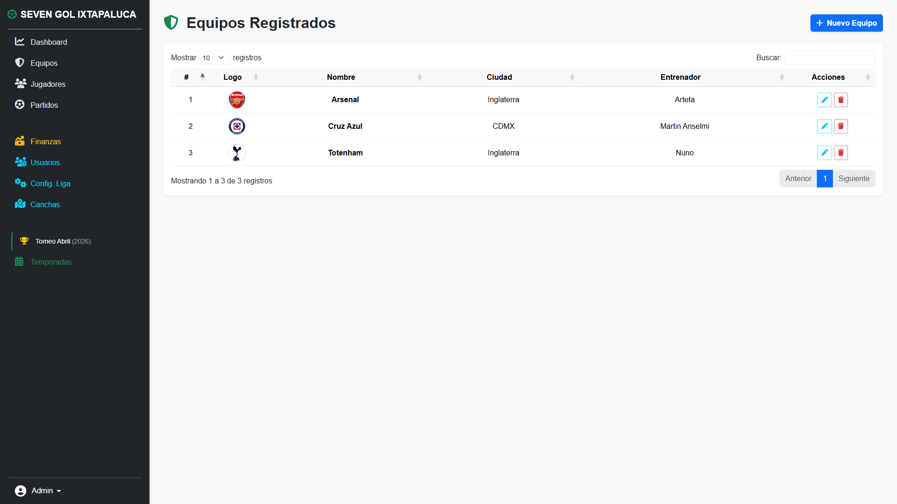
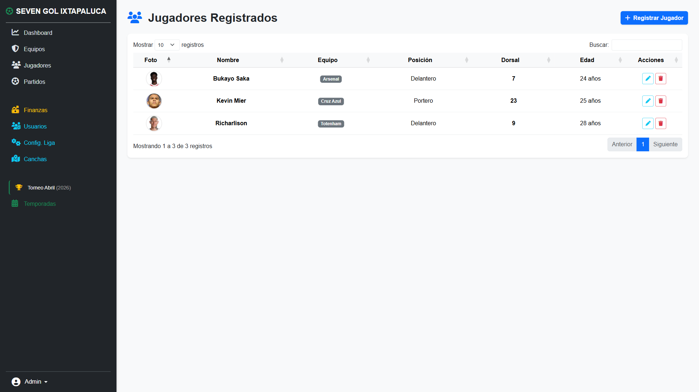
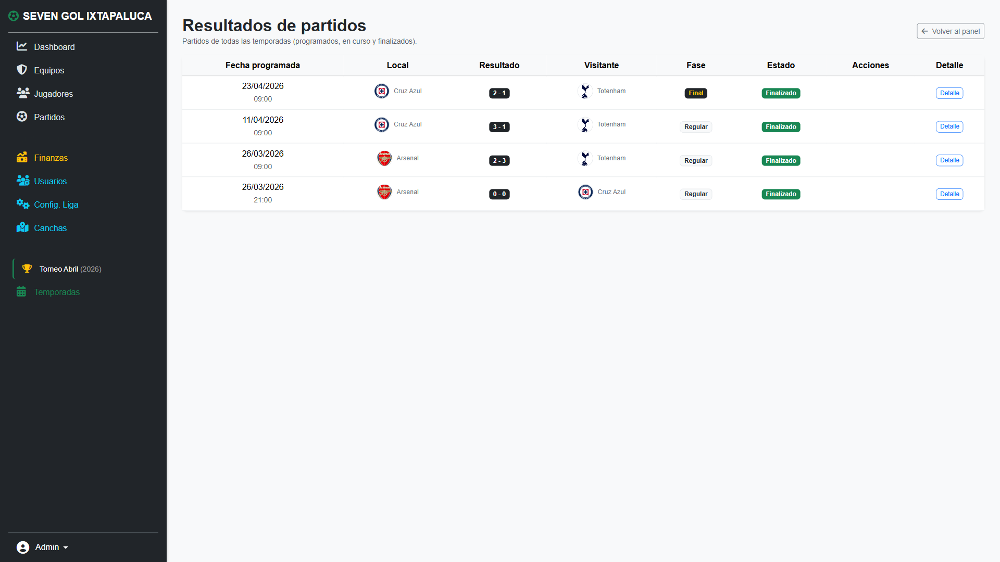

# 🏆 Sistema Web para Gestión de Ligas de Fútbol

Sistema web completo diseñado para la administración de ligas deportivas ⚽. Permite gestionar equipos, jugadores, torneos, partidos y estadísticas de manera eficiente desde una interfaz intuitiva.

---

## 📌 Descripción

Este sistema está enfocado en facilitar la organización de ligas de fútbol, automatizando procesos como:

* Registro de equipos y jugadores
* Creación de torneos
* Programación de partidos
* Registro de resultados
* Generación de tablas de posiciones

Plataformas similares destacan estas funcionalidades como base para la gestión deportiva moderna. ([GitHub][1])

---

## ✨ Características principales

✔️ Gestión de equipos
✔️ Registro de jugadores
✔️ Control de torneos
✔️ Fixture de partidos
✔️ Resultados y estadísticas
✔️ Tabla de posiciones automática
✔️ Interfaz web amigable

---

## 🧱 Tecnologías utilizadas

* 🐘 PHP
* 🗄️ MySQL
* 🌐 HTML / CSS
* ⚙️ JavaScript
* 🎨 Bootstrap

---

## 📸 Capturas del sistema

> ⚠️ Aquí debes agregar tus capturas

```md






```

---

## 🖥️ Instalación

1. Clonar el repositorio:

```bash
git clone https://github.com/DylanERS/APLICATIVO-PARA-LIGAS-DE-FUTBOL.git
```

2. Configurar base de datos en MySQL

3. Importar archivo `.sql` (si existe)

4. Configurar conexión en el proyecto

5. Ejecutar en servidor local (XAMPP, WAMP, etc.)

---

## 🔐 Acceso al sistema

Puedes crear un usuario manualmente en la base de datos o configurar uno por defecto.

---

## 📊 Módulos del sistema

* 👤 Usuarios / Login
* 🏟️ Equipos
* 🧍 Jugadores
* 📅 Partidos
* 🏆 Torneos
* 📈 Tabla de posiciones

---

## 💼 Uso comercial

Este sistema puede ser utilizado para:

* Ligas amateur
* Torneos escolares
* Academias deportivas
* Organizaciones locales

---

## 🚀 Futuras mejoras

* API REST
* App móvil
* Pagos en línea
* Estadísticas avanzadas

---

## 📞 Contacto

Desarrollado por **Dylan Emmanuel Rosario Sánchez**

📧 Contacto: (agrega tu correo)
📱 WhatsApp: (opcional)

---

## 📄 Licencia

Este proyecto puede ser utilizado con fines educativos o comerciales (definir licencia).

[1]: https://github.com/administracion-ligas-deportivas/sports-leagues-management?utm_source=chatgpt.com "Administración de Ligas Deportivas."
